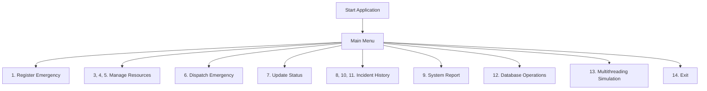

# FireResQ - Smart Fire & Emergency Response Management System

The **FireResQ - Smart Fire & Emergency Response Management System** is a Java console-based application designed to streamline the handling of fire emergencies and the dispatch of firefighting resources. By allowing dispatchers to register emergencies, assess severity and priority, and optimally allocate available fire trucks and firefighters, this system digitizes and organizes real-time incident management.

## Overview

This system provides comprehensive management of fire emergency lifecycles. Users can:

- **Register emergencies**: Record location, fire type, severity, and the number of people affected.
- **Manage resources**: Add and track the availability of Fire Stations, Fire Trucks, and Firefighters.
- **Dispatch resources**: Automatically calculate an emergency's priority score and assign available resources using a synchronized, multithreaded dispatch system.
- **Update status**: Track the incident status from `REPORTED` through `RESOLVED`.
- **Maintain records**: Save and read incident history using local files (`incident_history.txt`).
- **Database operations**: Persist, view, and update emergency records in a MySQL database.
- **System reporting**: Generate statistics on system usage and active resources.
- **Simulate calls**: Simulate simultaneous emergency calls to demonstrate thread safety and priority-based processing.

## Problem Statement

In emergency response situations, dispatchers must quickly prioritize incidents based on severity, the type of emergency (e.g., chemical vs. electrical), and the number of people at risk. Managing resources across multiple stations manually can lead to inefficiencies, resource misallocation, or delayed response times. This system addresses this by providing a priority-based dispatch mechanism, tracking resource availability precisely, and maintaining reliable incident records both locally and in a MySQL database.

## Objectives

- Manage fire emergency records efficiently.
- Prioritize emergencies automatically based on severity, people affected, and specific fire hazards (e.g., chemical fires).
- Allocate available fire trucks and firefighters to the most critical emergencies.
- Track the full emergency lifecycle through clear status transitions.
- Maintain a reliable incident history via local file storage.
- Demonstrate core Java programming concepts including Object-Oriented Programming (OOP), Multithreading, File I/O, and Database Connectivity (JDBC).

## Key Features

### Emergency Management

- **Registration**: Emergencies are assigned automatic IDs (e.g., `EMG-1`). Users provide a location, select a fire type (1-6), enter people affected, and choose a severity (1-4).
- **Priority Score**: Calculates automatically upon creation based on incident parameters.
- **Status Tracking**: Initializes as `REPORTED`.

### Fire Station Management

- **Station Records**: Add stations using a unique Station ID, Station Name, and Location.
- **Validation**: System prevents duplicate station IDs (using case-insensitive comparison).

### Fire Truck Management

- **Truck Records**: Add trucks with a unique Truck ID, Truck Type, and associated Station ID.
- **Validation**: Prevents duplicate Truck IDs and ensures the associated Station ID actually exists before creation.
- **Availability Tracking**: Defaults to `true` (available).

### Firefighter Management

- **Firefighter Records**: Add firefighters with a unique Firefighter ID, Name, and associated Station ID.
- **Validation**: Prevents duplicate IDs and verifies station existence.
- **Availability Tracking**: Defaults to `true` (available).

### Priority-Based Dispatch

When an emergency is reported, the system calculates a priority score:

- **Severity**: `CRITICAL` (+40), `HIGH` (+30), `MEDIUM` (+20), `LOW` (+10).
- **People Affected**: `>= 50` (+30), `>= 10` (+20), `> 0` (+10).
- **Chemical Fire Bonus**: `Chemical` type (+20).

The system searches all reported emergencies and selects the one with the highest priority score that has a valid resource pair (one available Fire Truck and one available Firefighter from the _same_ Fire Station) ready for dispatch.

### Emergency Status Lifecycle

The system strictly enforces this sequence:
`REPORTED` → `ASSIGNED` → `DISPATCHED` → `ON_SCENE` → `RESOLVED`

- Transitions are validated (e.g., you cannot jump from `REPORTED` to `RESOLVED`).
- When an emergency status is updated to `RESOLVED`, the exact truck and firefighter assigned to that emergency automatically become available again for new dispatches.

### Incident History (File I/O)

- **Save**: Writes the ID, Status, Location, and Severity of all current emergencies into a local `incident_history.txt` file.
- **Read**: Reads the `incident_history.txt` file and outputs it to the console.

### System Report

Provides a real-time summary displaying:

- Total emergencies registered
- Total emergencies resolved
- Total fire stations, fire trucks, and firefighters in memory

### MySQL Database Integration

- **Database**: `fire_emergency_db`
- **Table**: `emergencies` (Columns: `id`, `location`, `fire_type`, `severity`, `status`)
- **Operations**: Save an emergency to the database, view all database records, and update the status of a specific database record.
- **Initialization**: Automatically creates the table if it does not exist upon system startup.

### Multithreading Simulation

The system can auto-generate simulation resources and simultaneously create two new emergencies (Sector A & Sector B) via `EmergencyProcessingThread`. Two threads call the `DispatchManager` simultaneously. A `synchronized` block ensures that the highest-priority emergency is safely evaluated and assigned resources without race conditions.

## Technologies Used

| Technology           | Usage in Project                                                    |
| -------------------- | ------------------------------------------------------------------- |
| **Java**             | Core programming language (Java 8+ recommended).                    |
| **Java Collections** | `ArrayList` for storing runtime objects.                            |
| **MySQL**            | Relational database for persistent emergency records.               |
| **JDBC**             | Connecting Java to MySQL.                                           |
| **File I/O**         | `FileWriter`, `FileReader`, `BufferedReader`, `BufferedWriter`.     |
| **Multithreading**   | `Thread` class, `synchronized` keyword, `join()`, `Thread.sleep()`. |

## Java Concepts Demonstrated

### OOP

- **Class and Object**: Concrete models like `FireStation`, `FireTruck`, `Firefighter`, `Dispatch`.
- **Encapsulation**: Private fields accessed via getters/setters (e.g., `isAvailable()`, `setStatus()`).
- **Abstraction**: `abstract class Emergency` with an abstract method `displayEmergencyDetails()`.
- **Inheritance**: `FireEmergency` extends `Emergency`.
- **Polymorphism**: The `displayEmergencyDetails()` method is overridden in the subclass.

### Other Java Concepts

- **Enums**: `EmergencyStatus`, `FireSeverity`.
- **Exception Handling**: Standard `try-catch` blocks and custom exception classes (`InvalidEmergencyException`, `NoResourceAvailableException`, `InvalidInputException`).
- **File Handling**: Generating and parsing `.txt` files.
- **Multithreading & Synchronization**: Extending the `Thread` class and marking the dispatch method as `synchronized` to ensure thread-safe resource allocation.

## Project Structure

```text
Project-Root/
├── src/
│   └── SmartFireEmergencySystem.java   # Main application source code
├── lib/
│   └── mysql-connector-j-26.7.0.jar    # JDBC driver for MySQL
├── incident_history.txt                # Local file storage (created upon saving)
└── README.md                           # Project documentation
```

## Requirements / Prerequisites

1. **Java Development Kit (JDK)** installed.
2. **MySQL Server** installed and running.
3. Command Line Interface (Windows PowerShell / Command Prompt / Terminal).

Verify installations:

```bash
java -version
javac -version
mysql --version
```

## Complete Setup Guide

### Step 1 — Get the Project

Clone the repository or extract the provided ZIP file into a folder on your machine.

```bash
git clone https://github.com/sumit25bai10961/FireResQ-Smart-Fire-Emergency-Response-Management-System
```

### Step 2 — Open the Project Folder

Open your terminal (or PowerShell) and navigate to the project root:

```powershell
cd "path\to\project Fire"
```

### Step 3 — Install and Configure MySQL

1. Install and start MySQL Server.
2. Open your MySQL client (Command Line or Workbench) as `root`.
3. Create the database:
   ```sql
   CREATE DATABASE fire_emergency_db;
   ```
4. Verify your local MySQL credentials. The Java code defaults to:
   - Username: `root`
   - Password: `password`

_(Note: If your local MySQL root password is different, you must update the `PASSWORD` variable in the `DatabaseManager` class in `src/SmartFireEmergencySystem.java` before compiling)._

## Database Configuration

The connection is configured in the `DatabaseManager` class:

```java
private static final String URL = "jdbc:mysql://localhost:3306/fire_emergency_db";
private static final String USER = "root";
private static final String PASSWORD = "password";
```

- `localhost:3306` points to your local MySQL instance.
- The system automatically creates the `emergencies` table if it doesn't exist when the application launches.
  _(Security Note: Hard-coded credentials are used here for academic demonstration purposes. In production, environment variables should be used)._

## JDBC Driver / Dependency Setup

The project uses `mysql-connector-j-26.7.0.jar` located in the `lib` folder.
You must include this JAR in your classpath when compiling and running the application.

## Compilation

Ensure you are at the project root. Compile the source code by specifying the output directory and the classpath.

**Windows PowerShell:**

```powershell
javac -cp "lib\mysql-connector-j-26.7.0.jar" -d . src\SmartFireEmergencySystem.java
```

**Linux / macOS:** _(Note the `:` separator instead of `;`)_

```bash
javac -cp "lib/mysql-connector-j-26.7.0.jar" -d . src/SmartFireEmergencySystem.java
```

## Running the Application

Execute the compiled code, including both the current directory (`.`) and the `lib` folder in the classpath.

**Windows PowerShell:**

```powershell
java -cp ".;lib\mysql-connector-j-26.7.0.jar" SmartFireEmergencySystem
```

**Linux / macOS:**

```bash
java -cp ".:lib/mysql-connector-j-26.7.0.jar" SmartFireEmergencySystem
```

### Expected Startup Output

```text
========================================
SMART FIRE & EMERGENCY RESPONSE SYSTEM
========================================
1. Register Emergency
2. View Emergencies
3. Manage Fire Stations
4. Manage Fire Trucks
5. Manage Firefighters
6. Dispatch Highest Priority Emergency
7. Update Emergency Status
8. View Incident History
9. Generate System Report
10. Save Incident History
11. View Saved Incident History
12. Database Operations
13. Simulate Multiple Emergency Calls
14. Exit

Enter your choice:
```

## Complete Application Usage Guide

1. **Register Emergency**: Create a new incident. Enter location, select Fire Type from a numbered menu (1-6), enter people affected, and select Severity (1-4). Outputs an Emergency ID.
2. **View Emergencies**: Prints all active emergencies in memory, displaying ID, Location, Type, Severity, Priority Score, and Status.
3. **Manage Fire Stations**: Add a station (ID, Name, Location) or view all registered stations.
4. **Manage Fire Trucks**: Add a truck (Truck ID, Station ID, Type) or view all trucks and their availability.
5. **Manage Firefighters**: Add a firefighter (Firefighter ID, Station ID, Name) or view all firefighters and their availability.
6. **Dispatch Highest Priority Emergency**: The system automatically finds the reported emergency with the highest priority score and pairs it with the first available Fire Truck and Firefighter from the same station.
7. **Update Emergency Status**: Input an Emergency ID to step its status forward (e.g. `ASSIGNED` to `DISPATCHED`). Selecting `RESOLVED` frees the assigned resources.
8. **View Incident History**: Displays the timestamp, ID, location, and status of all memory records.
9. **Generate System Report**: Prints a summary count of emergencies, resolved emergencies, stations, trucks, and firefighters.
10. **Save Incident History**: Writes current memory emergencies to `incident_history.txt`.
11. **View Saved Incident History**: Reads and prints the contents of `incident_history.txt`.
12. **Database Operations**: Sub-menu to Save, View, and Update emergencies in MySQL.
13. **Simulate Multiple Emergency Calls**: Automatically injects test resources (if none exist) and spawns two concurrent threads that report and attempt to dispatch two distinct emergencies simultaneously.
14. **Exit**: Gracefully shuts down the application.

## Example Complete Workflow

As a first-time evaluator, follow these steps to test the system:

1. Press `3` -> `1` to add a Fire Station (e.g., ID: `ST01`, Name: `Central`, Loc: `Downtown`).
2. Press `4` -> `1` to add a Fire Truck (e.g., ID: `TRK01`, Station ID: `ST01`, Type: `Pumper`).
3. Press `5` -> `1` to add a Firefighter (e.g., ID: `FF01`, Station ID: `ST01`, Name: `Alice`).
4. Press `1` to Register an Emergency (Loc: `Bhopal Market`, Type: `1` (Electrical), People: `15`, Sev: `3` (High)). Note the generated ID (`EMG-1`).
5. Press `2` to view the emergency and observe its calculated priority score.
6. Press `6` to Dispatch. You will see a success message linking `TRK01` and `FF01` to `EMG-1`.
7. Press `4` -> `2` to view trucks. Observe `TRK01` is now `Avail: false`.
8. Press `7` to Update Emergency Status. Enter `EMG-1` and choose `4` (`ON_SCENE`).
9. Press `7` again and choose `5` (`RESOLVED`). Observe the console output stating resources are freed.
10. Press `4` -> `2` again. `TRK01` is now `Avail: true`.
11. Press `10` to save the history to a text file, and `11` to read it back.

## Database Operations Example

Press `12` from the main menu to open the Database Menu:

- **1. Save Emergency to Database**: Type the Emergency ID (e.g., `EMG-1`). A successful connection inserts the record into MySQL.
- **2. View Emergencies from Database**: Executes `SELECT * FROM emergencies` and displays the records.
- **3. Update Emergency Status in Database**: Type the Emergency ID and the text of the new status (e.g., `RESOLVED`). Executes an `UPDATE` query.
- **4. Back**: Returns to the main menu.

## Multithreading Simulation Example

Press `13` from the main menu.
The system will:

1. Automatically create `ST-SIM`, `TRK-SIM1`, `TRK-SIM2`, `FF-SIM1`, `FF-SIM2` (if no stations exist).
2. Generate `Sector A` (Electrical, High severity, 15 people) and `Sector B` (Chemical, Critical severity, 50 people).
3. Start `Thread-1` and `Thread-2`.
4. Using the `synchronized` `dispatchEmergency()` method, the system will safely evaluate priority. Sector B has a higher priority and will be assigned resources first, immediately followed by Sector A.

## File Handling

The system uses `FileWriter` and `BufferedWriter` to create/overwrite `incident_history.txt` at the project root when selecting Menu Option 10. Menu Option 11 uses `FileReader` and `BufferedReader` to stream the text to the console.

## Exception Handling

- `InvalidEmergencyException`: Thrown if a dispatch is attempted but there are no `REPORTED` emergencies, or if an invalid ID is provided.
- `NoResourceAvailableException`: Thrown if emergencies exist, but no Station has a matching available Truck and Firefighter pair.
- `InvalidInputException`: Thrown for entering negative numbers, choosing invalid menu options, expecting numbers but receiving text, or attempting invalid status transitions.

## Emergency Priority Logic

The priority score formula evaluates:

- **Severity**: `CRITICAL` (+40), `HIGH` (+30), `MEDIUM` (+20), `LOW` (+10)
- **People Affected**: `>= 50` (+30), `>= 10` (+20), `> 0` (+10)
- **Chemical Fire**: (+20)

_Example Calculation 1:_ `HIGH` severity, 15 people, `Electrical` fire.
30 (High) + 20 (>=10 people) + 0 (Not Chemical) = **50 Priority Score**

_Example Calculation 2:_ `CRITICAL` severity, 55 people, `Chemical` fire.
40 (Critical) + 30 (>=50 people) + 20 (Chemical) = **90 Priority Score**

## Emergency Status Flow

`REPORTED` ➔ `ASSIGNED` ➔ `DISPATCHED` ➔ `ON_SCENE` ➔ `RESOLVED`
The system mathematically enforces this sequence. For example, if an emergency is `DISPATCHED`, attempting to transition it to `ASSIGNED` or `RESOLVED` throws an `InvalidInputException` defining the valid forward path.

## Architecture / Internal Working

- `Emergency` (Abstract): Base class containing ID, location, priority logic, and status.
- `FireEmergency`: Extends `Emergency` and implements `displayEmergencyDetails()`.
- `FireStation` / `FireTruck` / `Firefighter`: Models for the physical resources.
- `Dispatch`: A model linking a specific Truck and Firefighter to an Emergency ID.
- `DispatchManager`: Handles the complex logic of matching resources to the highest priority emergency synchronously.
- `DatabaseManager`: Isolates all JDBC/MySQL logic (connections, DDL, queries).
- `EmergencyProcessingThread`: A custom thread class executing simultaneous dispatches.
- `SmartFireEmergencySystem`: The main entry point containing the CLI menus and runtime memory (`ArrayList`s).

## Application Flow



## Running Project Output

The following screenshot shows the **Smart Fire & Emergency Response Management System running successfully in the terminal**. It demonstrates the application startup, main menu, and console-based interaction.

### Main Application Output

![Smart Fire & Emergency Response Management System - Running Output]


The application starts successfully and displays the main menu with options for emergency registration, resource management, priority-based dispatch, status updates, incident history, database operations, and multithreading simulation.

### Example Running Workflow

The following workflow can be performed after launching the application:

1. Start the Java application from the terminal.
2. The system displays the **Smart Fire & Emergency Response System** main menu.
3. Register a new emergency using **Option 1**.
4. Add and manage fire stations, fire trucks, and firefighters using **Options 3, 4, and 5**.
5. Dispatch the highest-priority emergency using **Option 6**.
6. Update the emergency status using **Option 7**.
7. View the incident history using **Option 8**.
8. Generate the system report using **Option 9**.
9. Save and view incident history using **Options 10 and 11**.
10. Perform MySQL database operations using **Option 12**.
11. Run the multiple emergency simulation using **Option 13**.

### Additional Output Screenshots.

They can be displayed in this README using:

![Emergency Registration]


![Emergency Dispatch]


![Database Operation]


Only add the additional images after the corresponding screenshots have been captured from the actual running application.


## Troubleshooting

- **'java' or 'javac' is not recognized**: Add the JDK `bin` directory to your System PATH environment variables.
- **Database initialization failed**: Ensure the MySQL service is running and listening on port 3306. Verify the username and password in `DatabaseManager` match your local MySQL configuration.
- **Class not found exceptions / DB Error**: You likely forgot to include the JDBC jar in your classpath during compile/execution, or you used incorrect syntax (e.g., `;` vs `:`).
- **No suitable fire resources are available**: You attempted a dispatch, but all resource pairs are currently in use, or you created a truck/firefighter for a station that doesn't exist.
- **Input Error: Expected a numeric value**: You typed a word when the menu prompted for a number.

## Common Mistakes to Avoid

- Forgetting to start the MySQL server before accessing Database Operations.
- Skipping the classpath `-cp` flag when running the app.
- Typing `st01` when the station was created as `ST01` (though the system handles case-insensitivity gracefully during dispatch, it's best practice to match casing).
- Trying to transition an emergency from `REPORTED` directly to `RESOLVED` (the system enforces step-by-step updates).

## Testing Checklist

- [ ] Java installed & `javac` working
- [ ] MySQL installed & server running
- [ ] JDBC connector `mysql-connector-j-26.7.0.jar` present in `lib/`
- [ ] Project compiled successfully with `-cp` flag
- [ ] Application launched successfully
- [ ] Fire station added
- [ ] Fire truck added
- [ ] Firefighter added
- [ ] Emergency registered and prioritized
- [ ] Emergency dispatched successfully
- [ ] Status updated to `RESOLVED` and resources freed
- [ ] Incident history saved and read from `.txt`
- [ ] Database save/view operations tested
- [ ] Multithreading simulation executed without crashing

## Learning Outcomes

By completing this project, the student demonstrates proficiency in:

- Building fully-functional CLI applications in Java.
- Designing Object-Oriented architectures with inheritance and abstraction.
- Enforcing data integrity with robust Exception Handling.
- Performing File I/O operations seamlessly.
- Establishing external connections via JDBC to MySQL databases.
- Writing thread-safe code for concurrent operations using the `synchronized` keyword.

## Academic / Project Context

This system was developed as an academic Java project to demonstrate the practical application of core Java concepts in a realistic, mission-critical emergency-response scenario.

## Author

Sumit Shrivastava | B.Tech CSE (AI & ML) | VIT Bhopal University
